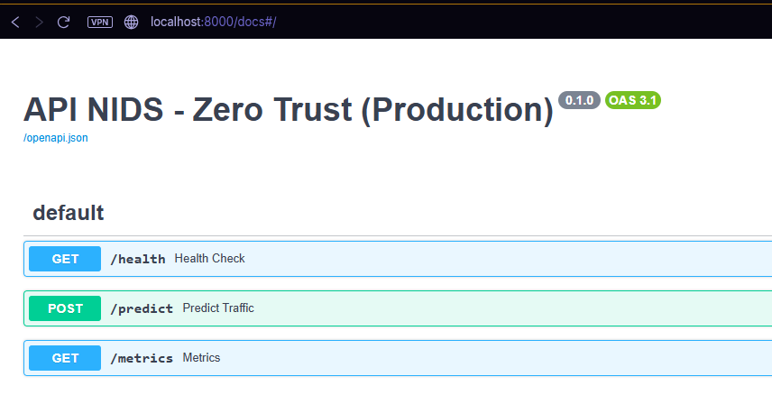
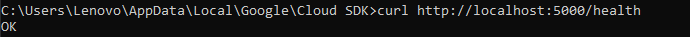
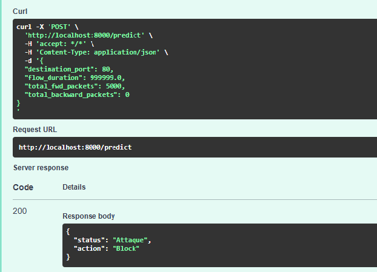
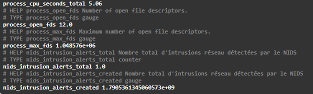
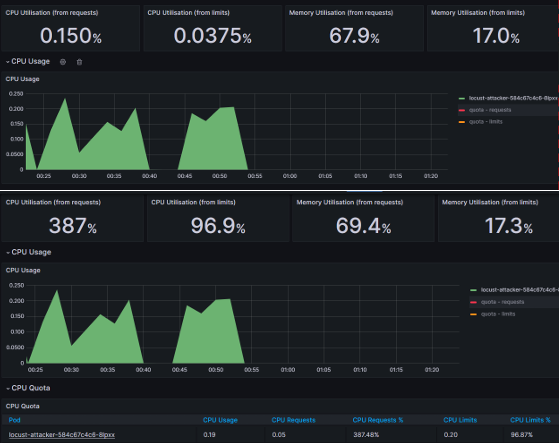

# 🛡️ NIDS Zero-Trust: Autonomous DevSecOps Architecture on GKE

> Design and Implementation of a Zero-Trust DevSecOps Architecture with Auto-Remediation for the Secure Deployment of a Network Intrusion Detection System (NIDS) Artificial Intelligence Model on Google Kubernetes Engine.

[](https://www.jenkins.io/)
[](https://www.terraform.io/)
[](https://cloud.google.com/)
[](https://istio.io/)
[](https://www.vaultproject.io/)
[](https://prometheus.io/)
[](https://mlflow.org/)

---

## 📖 Table of Contents

- [Project Overview](#-project-overview)
- [Global Architecture](#-global-architecture)
- [Technology Stack](#-technology-stack)
- [Project Structure](#-project-structure)
- [DevSecOps CI/CD Pipeline (Jenkinsfile)](#-devsecops-cicd-pipeline-jenkinsfile)
- [Auto-Remediation Loop (Closed-Loop)](#-auto-remediation-loop-closed-loop)
- [Prerequisites](#-prerequisites)
- [Deployment Guide](#-deployment-guide)
- [Security Testing & Demonstration](#-security-testing--demonstration)
- [Screenshots & Results](#-screenshots--results)
- [Infrastructure Cleanup (FinOps)](#-infrastructure-cleanup-finops)

---

## 🎯 Project Overview

This project implements a **comprehensive and autonomous DevSecOps architecture** based on the **Zero-Trust** security model ("Never trust, always verify"). It orchestrates the secure deployment of a **Network Intrusion Detection System (NIDS)** powered by Artificial Intelligence (XGBoost model trained via MLflow) on a **Google Kubernetes Engine (GKE)** cluster.

### Key Objectives

| Objective | Description |
|:---|:---|
| **Defense in Depth** | Each infrastructure layer is independently secured (Code, Container, Infrastructure, Network, Secrets). |
| **Application Zero-Trust (L7)** | Strict mTLS encryption via Istio Service Mesh. No inter-service communication without mutual authentication. |
| **Network Zero-Trust (L4)** | Kubernetes Firewall (Calico) and strict NetworkPolicies to isolate pods and block malicious network flows at the source. |
| **Dynamic Secrets Management** | Just-In-Time credential injection via HashiCorp Vault. No hardcoded secrets in the source code. |
| **External WAF Filtering** | Google Cloud Armor blocks malicious traffic (SQLi, XSS, DDoS) at the Cloud borders before it even reaches the cluster. |
| **Auto-Remediation & Forensics** | Closed loop (SOAR): Prometheus → Alertmanager → Jenkins. Autonomous isolation of attackers into an "Observation Cage" (NetworkPolicy) to preserve evidence. |

---

## 🏗️ Global Architecture

The architecture relies on **four security pillars** operating in-depth and a closed **auto-remediation loop**:

```text
┌─────────────────────────────────────────────────────────────────────────┐
│                        INTERNET (Inbound Traffic)                       │
└───────────────────────────────┬─────────────────────────────────────────┘
                                │
                    ┌───────────▼───────────┐
                    │   Google Cloud Armor   │  ← WAF Filtering (SQLi, XSS, DDoS)
                    │   (BackendConfig)      │
                    └───────────┬───────────┘
                                │
┌───────────────────────────────▼─────────────────────────────────────────┐
│                    Google Kubernetes Engine (GKE)                        │
│  ┌──────────────────────────────────────────────────────────────────┐   │
│  │                   Istio Service Mesh (STRICT mTLS)               │   │
│  │                                                                  │   │
│  │  ┌──────────────┐  ┌──────────────┐  ┌───────────────────────┐  │   │
│  │  │  NIDS Model   │  │   MLflow     │  │  Prometheus + Grafana │  │   │
│  │  │  (FastAPI +   │  │  (Model      │  │  (Monitoring +        │  │   │
│  │  │   XGBoost)    │  │   Registry)  │  │   Alerts)             │  │   │
│  │  └──────┬───────┘  └──────────────┘  └───────────┬───────────┘  │   │
│  │         │ /metrics (Prometheus)                    │              │   │
│  │         └─────────────────────────────────────────┘              │   │
│  │                                                                  │   │
│  │  ┌──────────────────────┐                                       │   │
│  │  │  Vault Agent Sidecar │  ← Dynamic secret injection           │   │
│  │  └──────────────────────┘                                       │   │
│  └──────────────────────────────────────────────────────────────────┘   │
│                                                                         │
│  Shielded Nodes: Secure Boot + Integrity Monitoring                     │
└─────────────────────────────────────────────────────────────────────────┘

        ┌──────────────────── AUTO-REMEDIATION LOOP ─────────────────────┐
        │                                                                 │
        │  Prometheus ──alert───▶ Alertmanager ──webhook──▶ Jenkins       │
        │                                                     │           │
        │                                      Apply NetworkPolicy        │
        │                                                     │           │
        │  Isolated Attacker (Cage) ◀──── Jenkins (Pipeline) ◀┘           │
        └─────────────────────────────────────────────────────────────────┘
```

---

## ⚙️ Technology Stack

| Layer | Tool | Role |
|:---|:---|:---|
| **Artificial Intelligence** | XGBoost + MLflow | Binary classification NIDS model (Healthy/Attack) with model registry |
| **Serving API** | FastAPI + Uvicorn | REST API exposing `/predict`, `/health`, and `/metrics` (Prometheus) |
| **Containerization** | Docker | Immutable image with a non-root user (`appuser`) |
| **CI/CD Orchestration** | Jenkins | Declarative multi-stage pipeline with security gates |
| **SAST Scan** | SonarQube | Static Application Security Testing on the source code |
| **Container CVE Scan** | Trivy (Aqua Security) | Detection of critical vulnerabilities in the Docker image |
| **IaC Scan** | tfsec (Aqua Security) | Static analysis of the Terraform configuration |
| **Infrastructure as Code** | Terraform + GCS Backend | Declarative provisioning of the GKE cluster with remote state |
| **Cloud Orchestration** | Google Kubernetes Engine | Managed Kubernetes cluster with Shielded Nodes |
| **Service Mesh (L7)** | Istio | Strict mTLS encryption, network observability, sidecar injection |
| **Network Firewall (L4)** | Calico | Implementation of NetworkPolicies, physical pod isolation, network Zero-Trust architecture |
| **Secrets Management** | HashiCorp Vault | Dynamic injection of GCP and MLflow credentials at runtime |
| **WAF** | Google Cloud Armor | Filtering malicious traffic upstream via BackendConfig |
| **Monitoring** | Prometheus + Grafana + Kiali | Real-time surveillance, alerts, network topology visualization |
| **SOAR (Auto-Remediation)**| Alertmanager + Jenkins Webhook | Autonomous isolation of compromised pods via NetworkPolicies (Quarantine) |
| **Attack Simulation** | Locust | Controlled Layer 7 DDoS simulation to test the Zero-Trust → Auto-Remediation chain |
| **Secure Tunnel** | Ngrok | Secure exposure of the Jenkins webhook for Alertmanager |

---

## 📂 Project Structure

```text
nids-zero-trust-pfe/
│
├── Jenkinsfile                    # Main CI/CD pipeline (7 DevSecOps stages)
├── Jenkinsfile.remediation        # Auto-remediation pipeline (Generic Webhook Trigger)
├── Dockerfile.jenkins             # Custom Jenkins image (Docker, Terraform, gcloud, kubectl)
├── docker-compose.yml             # Local orchestration (Jenkins + Vault + MLflow)
├── .gitignore                     # Exclusion of sensitive files and Terraform states
│
├── nids-app/                      # AI Application (NIDS Model)
│   ├── main.py                    # FastAPI API (predict, health, Prometheus metrics)
│   ├── Dockerfile                 # Secure Docker image (non-root)
│   ├── requirements.txt           # Python dependencies
│   └── .trivyignore               # Trivy exclusions
│
├── locust/                        # Attack Simulation (Chaos Engineering)
│   └── locustfile.py              # Layer 7 DDoS Script (Controlled HTTP Flood)
│
├── terraform/                     # Infrastructure as Code
│   └── main.tf                    # GKE Cluster + Shielded Nodes + GCS remote backend
│
├── k8s/                           # Kubernetes Manifests
│   ├── nids-deployment.yaml       # Deployment + Service (Vault + Cloud Armor annotations)
│   ├── nids-backendconfig.yaml    # Cloud Armor BackendConfig (WAF)
│   ├── locust-attack.yaml         # Locust Deployment (isolated namespace, outside Istio mesh)
│   ├── quarantine-networkpolicy.yaml # Calico Firewall (Forensics observation cage)
│   ├── mlflow-deployment.yaml     # MLflow deployment on GKE
│   ├── modele-fraude.yaml         # Fraud detection model
│   └── modele-nlp.yaml            # NLP model
│
├── alertmanager.yml               # Alertmanager configuration (Jenkins webhook routing)
├── prometheus-rules.yml           # Prometheus alert rules (NodeCompromised)
└── prometheus-config.yaml         # PrometheusRule CRD for Kube-Prometheus Operator
```

---

## 🔄 DevSecOps CI/CD Pipeline (Jenkinsfile)

The main pipeline executes **7 sequential stages** with security gates at every level:

```text
┌──────────────┐    ┌──────────────┐    ┌──────────────┐    ┌──────────────┐
│ 1. SAST      │───▶│ 2. Docker    │───▶│ 3. Trivy     │───▶│ 4. tfsec     │
│ (SonarQube)  │    │ (Build)      │    │ (CVE Scan)   │    │ (IaC Scan)   │
└──────────────┘    └──────────────┘    └──────────────┘    └──────┬───────┘
                                                                   │
┌──────────────┐    ┌──────────────┐    ┌──────────────────────────▼───────┐
│ 7. ConfigMap │◀───│ 6. GKE + Istio│◀──│ 5. Vault + Terraform            │
│ (Monitoring) │    │ Deployment   │    │ (Secrets + GKE Cluster)         │
└──────────────┘    └──────────────┘    └─────────────────────────────────┘
```

| Stage | Name | Description |
|:---|:---|:---|
| 1 | Code Security (SAST) | SonarQube scan of the FastAPI code |
| 2 | Containerization (Docker) | Immutable Docker image build |
| 3 | Container Security (Trivy) | Scan for critical CVE vulnerabilities |
| 4 | Infrastructure Security (tfsec) | Static analysis of Terraform code |
| 5 | Zero-Trust Deployment (Vault + TF)| Secure retrieval of GCP secrets via Vault, GKE cluster provisioning |
| 5.5 | NIDS Model Build & Push | Build and publish the Docker image on Docker Hub |
| 6 | Deployment on GKE | Istio installation (STRICT mTLS), K8s manifests deployment, monitoring ConfigMaps injection |

---

## 🔁 Auto-Remediation Loop (Closed-Loop)

The auto-remediation loop allows the system to **make autonomous decisions** in case of compromise, without human intervention:

```text
 ┌──────────────┐         ┌──────────────┐         ┌──────────────┐
 │  Prometheus  │──alert──▶ Alertmanager │─webhook─▶   Jenkins    │
 │ (Detection)  │         │  (Routing)   │         │(Remediation) │
 └──────┬───────┘         └──────────────┘         └──────┬───────┘
        │                                                 │
        │                                                 │
        │ CPU / Network Metrics          kubectl apply -f quarantine.yaml
        │                                                 │
        │                                                 ▼
 ┌──────┴───────┐                              ┌─────────────────────────┐
 │ GKE Cluster  │◀────── Isolation ────────────│    Jenkins (SOAR)       │
 │ (Monitored)  │        (NetworkPolicy)       │ (Quarantine Enforced)   │
 └──────────────┘                              └─────────────────────────┘
```

### The Forensics Strategy: The Observation Cage (Sandbox)

Rather than brutally destroying the attacker's pod (which would erase all evidence), auto-remediation adopts a professional **SOC (Security Operations Center)** approach:
1. Jenkins applies a **strict NetworkPolicy** via the **Calico** engine.
2. The attacker's outbound traffic (Egress) is physically cut off. The attacker is unable to harm the rest of the cluster.
3. Inbound traffic (Ingress) remains open only on the administration interface (e.g., port 8089) to allow the security team to safely observe the malware's behavior (Forensics).

### Files Involved

| File | Role |
|:---|:---|
| `prometheus-rules.yml` | Defines the `NodeCompromised` alert rule based on abnormal pod CPU usage (symptom of a DDoS attack loop) |
| `alertmanager.yml` | Routes the critical alert to the Jenkins webhook (via Ngrok in lab) and groups alerts |
| `Jenkinsfile.remediation` | Pipeline triggered by the webhook: verifies the alert and instantly applies the quarantine `NetworkPolicy` to isolate the attacker. |

---

## 📋 Prerequisites

| Tool | Minimum Version | Usage |
|:---|:---|:---|
| Docker Desktop | 24.x | Local execution of Jenkins, Vault, MLflow |
| Google Cloud SDK | Latest | GCP authentication and management |
| Terraform | 1.5+ | Provisioning of the GKE cluster |
| Ngrok | 3.x | HTTPS tunnel for the Jenkins webhook |
| GCP Account | — | Configured `zero-trust-mlops-pfe` project |

---

## 🚀 Deployment Guide

### Step 1: Local Environment Initialization

```bash
# Start the local infrastructure (Jenkins + Vault + MLflow)
docker-compose up -d

# Verification: Jenkins accessible at http://localhost:8080

# Launch Ngrok tunnel to expose the Jenkins webhook
ngrok http 8080
# ⚠️ Copy the generated HTTPS URL and update alertmanager.yml
```

### Step 2: Cloud Infrastructure Deployment (IaC)

```bash
cd terraform/
terraform init          # Sync with the remote GCS backend
terraform apply -auto-approve  # Provision the GKE cluster

# Retrieve kubectl credentials
gcloud container clusters get-credentials nids-zero-trust-cluster \
  --zone europe-west1-b --project zero-trust-mlops-pfe
```

### Step 3: Execute the Jenkins Pipeline

1. Access Jenkins (`http://localhost:8080`).
2. Select the **NIDS-Deployment** pipeline → **Build Now**.
3. The pipeline automatically deploys: Istio mTLS, K8s manifests, and monitoring ConfigMaps.

### Step 4: Control Center Activation (SOC)

```bash
# Terminal 1: Grafana (Monitoring dashboard)
kubectl port-forward svc/grafana -n monitoring 3000:3000
# Access: http://localhost:3000 (admin/admin)

# Terminal 2: Kiali (Istio network topology)
kubectl port-forward svc/kiali -n istio-system 20001:20001
# Access: http://localhost:20001
```

---

## ⚔️ Security Testing & Demonstration

### Scenario A: Proof of Hermetic mTLS Protection

Deployment of an intruder pod (Rogue Pod) from an unauthorized namespace:

```bash
# Launch a malicious container in kube-system (outside the Istio mesh)
kubectl run hacker-pod --image=curlimages/curl -n kube-system -it --rm -- sh

# Attempt to communicate with the NIDS service
while true; do
  curl -s -o /dev/null -w "Status: %{http_code}\n" \
    http://nids-model-service.default.svc.cluster.local:5000/health
  sleep 0.1
done
```

**Expected Result**: All requests fail with `curl: (28) Failed to connect`. Istio's Zero-Trust architecture intercepts and rejects the attack at the TCP level because the intruder pod lacks a valid mTLS certificate.

### Scenario B: MLOps Inference Validation (XGBoost)

Simulation of sending legitimate and malicious network flows to the inference API to validate the AI model:

1. **Health Check**: A call to the `/health` endpoint confirms that the XGBoost model is correctly loaded from MLflow.
2. **Nominal Flow**: Sending a JSON vector representing standard HTTPS traffic (port 443). The API instantly returns `{"status": "Healthy", "action": "Allow"}`.
3. **Malicious Flow**: Sending a vector representing an attack (e.g., 5000 packets sent, 0 received). The API identifies the anomaly, dynamically converts the data into `xgb.DMatrix`, exceeds the 0.5 threshold, and returns `{"status": "Attack", "action": "Block"}`.
4. **Metrics Update**: The Prometheus `/metrics` counter automatically increments (`nids_intrusion_alerts_total = 1.0`).

### Scenario C: Organic Triggering of Auto-Remediation (Locust)

Deployment of a **Locust** attack simulator in an isolated namespace (outside the Istio mesh) to trigger the SOAR chain (Prometheus → Alertmanager → Jenkins → Calico):

```bash
# 1. Deploy the attack simulator
kubectl apply -f k8s/locust-attack.yaml

# 2. Access the Locust dashboard (http://localhost:8089)
kubectl port-forward svc/locust-service -n attack-simulation 8089:8089
```

**Observed Automatic Kinematics (The Forensic Trap)**:
1. Locust sends hundreds of requests to the NIDS (blocked by Istio).
2. This network relentless assault causes a CPU spike on the attacker's end, detected by Prometheus via the `NodeCompromised` rule.
3. The alert shifts to the **FIRING** state and is forwarded to Alertmanager, which triggers the Jenkins webhook.
4. The `NIDS-Auto-Remediation` pipeline is launched and instantly deploys a **Calico NetworkPolicy**.
5. **The Trap Closes**: All outbound traffic (Egress) from the attacker is physically cut off.
6. Locust's CPU spikes out of control (panic state visible on Grafana), proving that the threat is neutralized and locked in the observation Sandbox.

---

## 📸 Screenshots and Results

### NIDS API — OpenAPI Documentation (Swagger)
> The FastAPI API exposes three essential endpoints for the Cloud-Native architecture: `/health`, `/predict`, and `/metrics`.



---

### MLOps Inference — Health Check
> Preliminary validation confirming the correct loading of the XGBoost model in memory.



---

### MLOps Inference — Legitimate Flow (Healthy)
> The model analyzes the packet characteristics and allows passage.


---

### MLOps Inference — Attack Detection (Block)
> Identification of a statistical anomaly and triggering of the blocking instruction.



---

### Monitoring — Metrics Update (Prometheus)
> Automatic incrementation of the `nids_intrusion_alerts_total` counter following attack detection.



---

### Auto-Remediation — Forensic Isolation (CPU Panic)
> Comparison of the attacker's CPU before and after applying the Calico NetworkPolicy. At the bottom, the runaway (panic) state proves complete isolation of the threat in the sandbox.



---

## 🗑️ Infrastructure Cleanup (FinOps)

Once the demonstration is over, destroy all Cloud resources to prevent any residual billing:

```bash
cd terraform/
terraform destroy -auto-approve
```

---

## 👤 Author

**Mossaab Belazri** 

[](https://github.com/mossaabbelazri)

---

## 📄 License

This project is open-source and available under the Apache License 2.0.
